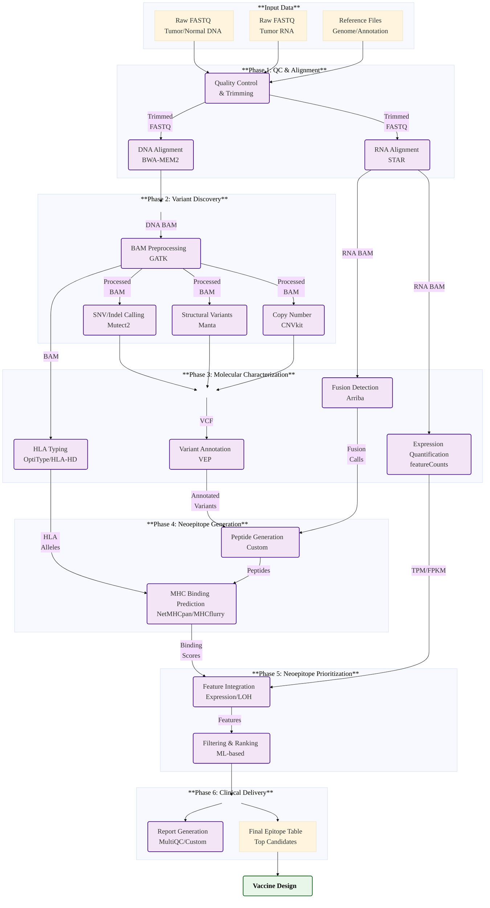

```mermaid
%%{init: {
'theme': 'base',
'themeVariables': {
'fontSize': '21px',
'fontFamily': 'Arial, sans-serif'
}
}}%%
flowchart TD
%% --- 1. Define Styles ---
classDef bigFont font-size:24px, padding:10px
classDef inputFill fill:#e1f5fe,stroke:#01579b,stroke-width:2px,rx:5px,ry:5px
classDef processFill fill:#f3e5f5,stroke:#4a148c,stroke-width:2px,rx:5px,ry:5px
%% A new style for the final, actionable deliverables
classDef deliverableFill fill:#e8f5e9,stroke:#1b5e20,stroke-width:2px,color:#000,font-weight:bold,rx:5px,ry:5px
%% User-specified color for the "end state" nodes
 classDef endStateFill fill:#e8f5e9,stroke:#1b5e20,stroke-width:2px,color:#000,font-weight:bold,rx:5px,ry:5px
 classDef spacer fill:none,stroke:none;


  subgraph "**Input Data**"
      FASTQ_DNA[Raw FASTQ<br/>Tumor/Normal DNA]
      FASTQ_RNA[Raw FASTQ<br/>Tumor RNA]
      REF[Reference Files<br/>Genome/Annotation]
  end
   subgraph phase1["**Phase 1: QC & Alignment**"]
      QC[Quality Control<br/>& Trimming]:::processFill
      DNA_ALN[DNA Alignment<br/>BWA-MEM2]:::processFill
      RNA_ALN[RNA Alignment<br/>STAR]:::processFill
  end
   subgraph "**Phase 2: Variant Discovery**"
      spacer2[ ]:::spacer
      BAM_PROC[BAM Preprocessing<br/>GATK]:::processFill
      SNV[SNV/Indel Calling<br/>Mutect2]:::processFill
      SV[Structural Variants<br/>Manta]:::processFill
      CNV[Copy Number<br/>CNVkit]:::processFill
  end
   subgraph "**Phase 3: Molecular Characterization**"
      spacer3[ ]:::spacer
      VEP[Variant Annotation<br/>VEP]:::processFill
      FUSION[Fusion Detection<br/>Arriba]:::processFill
      EXPR[Expression Quantification<br/>featureCounts]:::processFill
      HLA[HLA Typing<br/>OptiType/HLA-HD]:::processFill
  end
   subgraph "**Phase 4: Neoepitope Generation**"
      PEPTIDE[Peptide Generation<br/>Custom]:::processFill
      MHC[MHC Binding Prediction<br/>NetMHCpan/MHCflurry]:::processFill
  end
   subgraph "**Phase 5: Neoepitope Prioritization**"
      INTEGRATE[Feature Integration<br/>Expression/LOH]:::processFill
      RANK[Filtering & Ranking<br/>ML-based]:::processFill
  end
   subgraph "**Phase 6: Clinical Delivery**"
      spacer4[ ]:::spacer
      REPORT[Report Generation<br/>MultiQC/Custom]:::processFill
      FINAL[Final Epitope Table<br/>Top Candidates]
  end
   FASTQ_DNA --> QC
  FASTQ_RNA --> QC
  REF --> QC
  QC --> |Trimmed<br/>FASTQ| DNA_ALN
  QC --> |Trimmed<br/>FASTQ| RNA_ALN


  DNA_ALN --> spacer2
  spacer2 --> |DNA BAM| BAM_PROC
  BAM_PROC --> |Processed<br/>BAM| SNV
  BAM_PROC --> |Processed<br/>BAM| SV
  BAM_PROC --> |Processed<br/>BAM| CNV
  RNA_ALN --> |RNA BAM| FUSION
  RNA_ALN --> |RNA BAM| EXPR
  BAM_PROC --> |BAM| HLA
  SNV --> spacer3
  SV --> spacer3
  CNV --> spacer3
  spacer3 --> |VCF| VEP
  VEP --> |Annotated<br/>Variants| PEPTIDE
  FUSION --> |Fusion<br/>Calls| PEPTIDE
  HLA --> |HLA<br/>Alleles| MHC
  PEPTIDE --> |Peptides| MHC
  MHC --> |Binding<br/>Scores| INTEGRATE
  EXPR --> |TPM/FPKM| INTEGRATE
  INTEGRATE --> |Features| RANK
  RANK --> spacer4
  spacer4 --> REPORT
  spacer4 --> FINAL
   FINAL --> VACCINE[Vaccine Design]:::endStateFill
```
