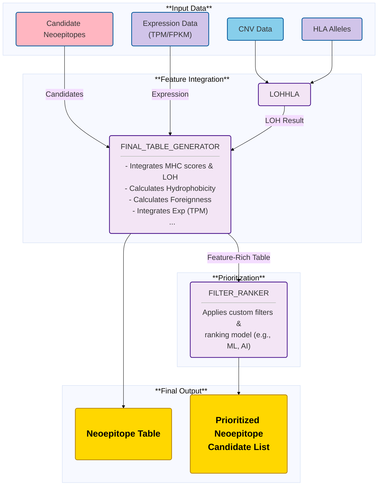

```mermaid
%%{init: {
'theme': 'base',
'themeVariables': {
'fontSize': '20px',
'fontFamily': 'arial'
}
}}%%
flowchart TD
  %% --- 1. 定义样式 ---
  classDef bigFont font-size:24px, padding:10px
  classDef inputFillPhase2 fill:#87CEEB,stroke:#01579b,stroke-width:2px,rx:5px,ry:5px
  classDef inputFillPhase3 fill:#d1c4e9,stroke:#01579b,stroke-width:2px,rx:5px,ry:5px
  classDef inputFillPhase4 fill:#FFB6C1,stroke:#01579b,stroke-width:2px,rx:5px,ry:5px
  %% 用户指定的输出颜色
  classDef outputFill fill:#FFD700,stroke:#B8860B,stroke-width:2px,color:#000,font-weight:bold,rx:5px,ry:5px
  classDef processFill fill:#f3e5f5,stroke:#4a148c,stroke-width:2px,rx:5px,ry:5px
  classDef invisible height:20px,fill:transparent,stroke:transparent


  %% --- 2. Input Data ---
  subgraph "**Input Data**"
     direction LR
     A[Candidate Neoepitopes]:::inputFillPhase4
     B[Expression Data<br/>&#40TPM/FPKM&#41]:::inputFillPhase3
     C[CNV Data]:::inputFillPhase2
     D[HLA Alleles]:::inputFillPhase3
  end


  %% --- 3. Feature Integration ---
  subgraph "**Feature Integration**"
     direction LR
 
        E[LOHHLA]:::processFill


        %% 整合了F1-F4的细节，使图表更简洁
        F[FINAL_TABLE_GENERATOR<br/><hr/>- Integrates MHC scores & LOH<br/>- Calculates Hydrophobicity<br/>- Calculates Foreignness<br/>- Integrates Exp &#40TPM&#41<br/>  ...  ]:::processFill
    
  end


  %% --- 4. Epitope Prioritization ---
  subgraph "**Prioritization**"
     direction TB
     G[FILTER_RANKER<br/><hr/>Applies custom filters &<br/>ranking model &#40e.g., ML, AI&#41]:::processFill
  end


  %% --- 5. Final Output ---
  subgraph "**Final Output**"
     H[Neoepitope Table]:::outputFill
     I[Prioritized Neoepitope<br/>Candidate List]:::outputFill
  end


  %% --- 6. Top-level Connections ---
  %% Inputs to LOHHLA
  C & D --> E


  %% Inputs to FINAL_TABLE_GENERATOR
  A -- "Candidates" --> F
  B -- "Expression" --> F
  E -- "LOH Result" --> F


  %% Input to FILTER_RANKER
  F -- "Feature-Rich Table" --> G


  %% Final Output Connection
  F --> H
  G --> I


  %% --- Apply Big Font Class ---
  class H,I bigFont

```
