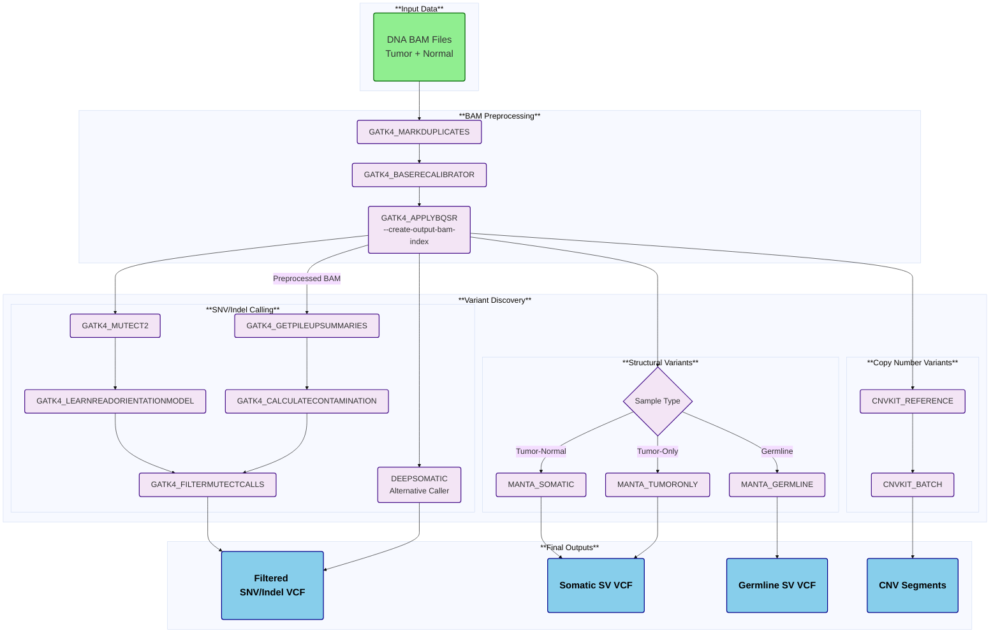

```mermaid
%%{init: {
'theme': 'base',
'themeVariables': {
  'fontSize': '20px',
  'fontFamily': 'arial'
}
}}%%
flowchart TD
  %% --- 1. Define Styles ---
  classDef bigFont font-size:24px, padding:10px
  %% User-specified colors are preserved here
  classDef inputFill fill:#90EE90,stroke:#006400,stroke-width:2px,rx:5px,ry:5px
  classDef outputFill fill:#87CEEB,stroke:#00008B,stroke-width:2px,color:#000,font-weight:bold,rx:5px,ry:5px
  %% Standard style for processing nodes
  classDef processFill fill:#f3e5f5,stroke:#4a148c,stroke-width:2px,rx:5px,ry:5px
  %% Invisible spacer style
  classDef invisible height:20px,fill:transparent,stroke:transparent


  %% --- 2. Input Data ---
  subgraph "**Input Data**"
      A[DNA BAM Files<br/>Tumor + Normal]:::inputFill
  end


  %% --- 3. BAM Preprocessing ---
  subgraph "**BAM Preprocessing**"
      direction TB
     
     B[GATK4_MARKDUPLICATES]:::processFill--> C[GATK4_BASERECALIBRATOR]:::processFill
      C --> D[GATK4_APPLYBQSR<br/>--create-output-bam-index]:::processFill
  end


  %% --- 4. Parallel Variant Discovery "Super-Subgraph" ---
  subgraph "**Variant Discovery**"
     direction LR
     subgraph "**SNV/Indel Calling**"
         direction TB
         E[GATK4_GETPILEUPSUMMARIES]:::processFill --> F[GATK4_CALCULATECONTAMINATION]:::processFill
         G[GATK4_MUTECT2]:::processFill --> H[GATK4_LEARNREADORIENTATIONMODEL]:::processFill
         H --> I[GATK4_FILTERMUTECTCALLS]:::processFill
         F --> I
         J[DEEPSOMATIC<br/>Alternative Caller]:::processFill
     end


     subgraph "**Structural Variants**"
         direction TB
         K{Sample Type}:::processFill
         K -->|Tumor-Normal| L[MANTA_SOMATIC]:::processFill
         K -->|Tumor-Only| M[MANTA_TUMORONLY]:::processFill
         K -->|Germline| N[MANTA_GERMLINE]:::processFill
     end


     subgraph "**Copy Number Variants**"
         direction TB
         O[CNVKIT_REFERENCE]:::processFill --> P[CNVKIT_BATCH]:::processFill
     end
  end


  %% --- 5. Final Outputs ---
  subgraph "**Final Outputs**"
     direction LR
     Q[Filtered SNV/Indel VCF]:::outputFill
     R[Somatic SV VCF]:::outputFill
     S[Germline SV VCF]:::outputFill
     T[CNV Segments]:::outputFill
  end


  %% --- 6. Top-level Connections ---
  A --> B
 
  D -- "Preprocessed BAM" --> E
  D --> G
  D --> J
  D --> K
  D --> O


  I --> Q
  J --> Q
  L --> R
  M --> R
  N --> S
  P --> T


  %% --- Apply Big Font Class ---
  class A,Q,R,S,T bigFont

```
