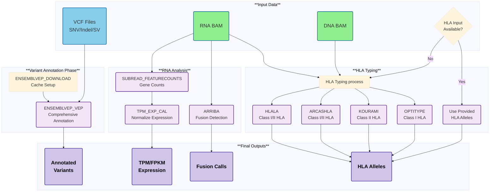

```mermaid
%%{init: {
'theme': 'base',
'themeVariables': {
'fontSize': '20px',
'fontFamily': 'arial'
}
}}%%
flowchart TD
%% --- 定义样式 ---
classDef bigFont font-size:24px, padding:10px
classDef inputFillPhase1 fill:#90EE90,stroke:#01579b,stroke-width:2px,rx:5px,ry:5px
classDef inputFillPhase2 fill:#87CEEB,stroke:#01579b,stroke-width:2px,rx:5px,ry:5px
classDef processFill fill:#f3e5f5,stroke:#4a148c,stroke-width:2px,rx:5px,ry:5px
classDef outputFill fill:#d1c4e9,stroke:#311b92,stroke-width:2px,color:#000,font-weight:bold,rx:5px,ry:5px

%% --- 主体流程 ---
subgraph Input ["**Input Data**"]
   direction LR  %% 让输入节点横向排列，看起来更整齐
   A[VCF Files<br/>SNV/Indel/SV]:::inputFillPhase2
   B[RNA BAM]:::inputFillPhase1
   C[DNA BAM]:::inputFillPhase1
   I{HLA Input<br/>Available?}
end

subgraph Variant_Annotation ["**Variant Annotation Phase**"]
   direction TB
   D[ENSEMBLVEP_DOWNLOAD<br/>Cache Setup] --> E[ENSEMBLVEP_VEP<br/>Comprehensive Annotation]:::processFill
end

subgraph RNA_Analysis ["**RNA Analysis**"]
   direction TB
   F[ARRIBA<br/>Fusion Detection]:::processFill
   G[SUBREAD_FEATURECOUNTS<br/>Gene Counts]:::processFill --> H[TPM_EXP_CAL<br/>Normalize Expression]:::processFill
end

subgraph HLA_Typing ["**HLA Typing**"]
   direction TB
   %% I{HLA Input<br/>Available?}
   %% 调整连接逻辑以改善布局：让决策节点 I 成为更明确的控制点
   I -->|Yes| L[Use Provided<br/>HLA Alleles]:::processFill
   I -->|No| RunHLA[HLA Typing process]
   %% 使用一个中间不可见节点或子图来组合 J 和 K，这里用简单的并列
   %%  RunHLA -.->|Requires| C
   B --> RunHLA
   C --> RunHLA
 
   RunHLA --> J[OPTITYPE<br/>Class I HLA]:::processFill
   RunHLA --> R[KOURAMI<br/>Class II HLA]:::processFill
   RunHLA --> S[ARCASHLA<br/>Class I/II HLA]:::processFill
   RunHLA --> K[HLALA<br/>Class I/II HLA]:::processFill
end

%% --- 输出层 (统一放在最下面) ---
subgraph Output ["**Final Outputs**"]
  direction LR
  M[Annotated<br/>Variants]:::outputFill
  N[Fusion Calls]:::outputFill
  O[TPM/FPKM<br/>Expression]:::outputFill
  P[HLA Alleles]:::outputFill
end


%% --- 跨子图的核心连接 ---
A --> E
B --> F
B --> G
%% C --> J  <-- 注释掉，通过 RunHLA 间接表达，或者保留但接受一点歪斜
%% C --> K  <-- 注释掉
%% --- 输出连接 ---
E --> M
F --> N
H --> O
J --> P
K --> P
R --> P
S --> P
L --> P

%% --- 应用大字体样式 ---
class A,B,C,M,N,O,P bigFont
%% --- 强制布局微调 (Hack) ---
%% 这是一些不可见的连接，有时能帮助调整左右位置，可以尝试注释/取消注释看看效果
%% Variant_Annotation ~~~ RNA_Analysis
%% RNA_Analysis ~~~ HLA_Typing

```
