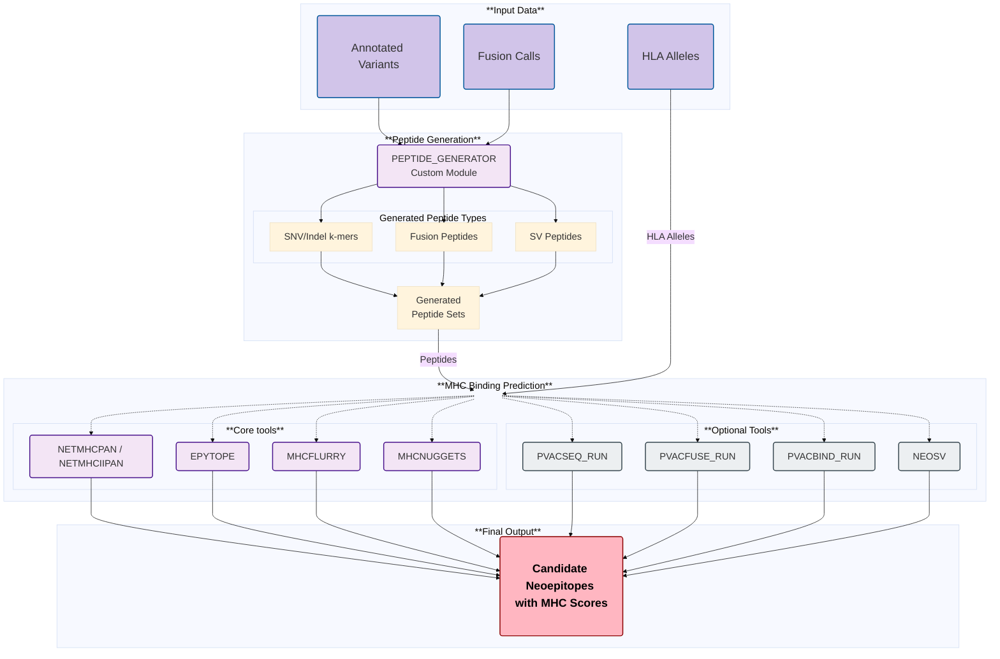

```mermaid
%%{init: {
'theme': 'base',
'themeVariables': {
'fontSize': '20px',
'fontFamily': 'arial'
}
}}%%
flowchart TD
%% --- 1. 定义样式 ---
classDef bigFont font-size:24px, padding:10px
classDef inputFill fill:#d1c4e9,stroke:#01579b,stroke-width:2px,rx:5px,ry:5px
%% 用户指定的输出颜色
classDef outputFill fill:#FFB6C1,stroke:#8B0000,stroke-width:2px,color:#000,font-weight:bold,rx:5px,ry:5px
%% 核心处理模块的样式
classDef processFill fill:#f3e5f5,stroke:#4a148c,stroke-width:2px,rx:5px,ry:5px
%% 新增: 可选/专用工具的样式，使用更低调的颜色
classDef optionalFill fill:#eceff1,stroke:#37474f,stroke-width:2px,rx:5px,ry:5px
%% 隐形占位节点样式
classDef invisible height:20px,fill:transparent,stroke:transparent


%% --- 2. Input Data ---
subgraph "**Input Data**"
    direction LR
    A[Annotated Variants]:::inputFill
    B[Fusion Calls]:::inputFill
    C[HLA Alleles]:::inputFill
end


%% --- 3. Peptide Generation ---
subgraph "**Peptide Generation**"
   direction TB
  D[PEPTIDE_GENERATOR<br/>Custom Module]:::processFill
    subgraph "Generated Peptide Types"
      direction LR
      D1[SNV/Indel k-mers]
      D2[Fusion Peptides]
      D3[SV Peptides]
   end
    D --> D1 & D2 & D3
   %% 将所有肽段汇集成一个概念性输出，以简化连接
   D1 & D2 & D3 --> Peps[Generated<br/>Peptide Sets]
end


%% --- 4. MHC Binding Prediction "Super-Subgraph" ---
subgraph "**MHC Binding Prediction**"
   direction TB
   %% 占位节点，作为所有预测工具的统一输入目标
   Pred_Spacer[ ]:::invisible


   subgraph "**Core tools**"
      direction LR
      E[NETMHCPAN / NETMHCIIPAN]:::processFill
      H[EPYTOPE]:::processFill
      F[MHCFLURRY]:::processFill
      I[MHCNUGGETS]:::processFill
   end


   subgraph "**Optional Tools**"
      direction LR
      %% 应用 optionalFill 样式
      G[PVACSEQ_RUN]:::optionalFill
      J[PVACFUSE_RUN]:::optionalFill
      K[PVACBIND_RUN]:::optionalFill
      L[NEOSV]:::optionalFill
   end
end


%% --- 5. Final Output ---
subgraph "**Final Output**"
   M[Candidate Neoepitopes with MHC Scores]:::outputFill
end


%% --- 6. Top-level Connections ---
A & B --> D
%% 简化连接：将肽段和HLA连接到预测阶段的占位节点
Peps -- "Peptides" --> Pred_Spacer
C -- "HLA Alleles" --> Pred_Spacer


%% 隐式连接：占位节点代表所有工具的输入
Pred_Spacer -.-> E & H & F & I
Pred_Spacer -.-> G & J & K & L


%% 所有预测工具的输出都汇集到最终结果
E & H & F & I --> M
G & J & K & L --> M


%% --- Apply Big Font Class ---
class A,B,C,M bigFont
```
