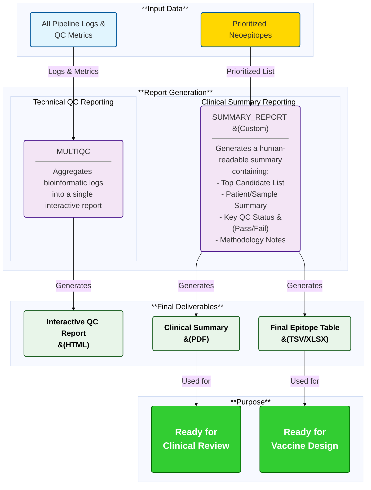

```mermaid
%%{init: {
'theme': 'base',
'themeVariables': {
'fontSize': '20px',
'fontFamily': 'arial'
}
}}%%
flowchart TD
  %% --- 1. Define Styles ---
  classDef bigFont font-size:24px, padding:10px
  classDef inputFill fill:#e1f5fe,stroke:#01579b,stroke-width:2px,rx:5px,ry:5px
  classDef inputFillphase5 fill:#FFD700,stroke:#01579b,stroke-width:2px,rx:5px,ry:5px
  classDef processFill fill:#f3e5f5,stroke:#4a148c,stroke-width:2px,rx:5px,ry:5px
  %% A new style for the final, actionable deliverables
  classDef deliverableFill fill:#e8f5e9,stroke:#1b5e20,stroke-width:2px,color:#000,font-weight:bold,rx:5px,ry:5px
  %% User-specified color for the "end state" nodes
  classDef endStateFill fill:#32CD32,stroke:#006400,stroke-width:2px,color:white,font-weight:bold,rx:5px,ry:5px
  classDef invisible height:20px,fill:transparent,stroke:transparent


  %% --- 2. Input Data ---
  subgraph "**Input Data**"
     direction LR
     A[Prioritized Neoepitopes]:::inputFillphase5
     B[All Pipeline Logs &<br/>QC Metrics]:::inputFill
  end


  %% --- 3. Report Generation Workflows ---
  subgraph "**Report Generation**"
     direction LR
     subgraph "Technical QC Reporting"
        D[MULTIQC<br/><hr/>Aggregates bioinformatic logs<br/>into a single interactive report]:::processFill
     end
    
     subgraph "Clinical Summary Reporting"
        E[SUMMARY_REPORT &#40;Custom&#41<br/><hr/>Generates a human-readable summary<br/>containing:<br/>- Top Candidate List<br/>- Patient/Sample Summary<br/>- Key QC Status &#40;Pass/Fail&#41<br/>- Methodology Notes]:::processFill
     end
  end


  %% --- 4. Final Deliverables ---
  subgraph "**Final Deliverables**"
     direction LR
     F[Interactive QC Report<br/>&#40;HTML&#41]:::deliverableFill
     G[Clinical Summary<br/>&#40;PDF&#41]:::deliverableFill
     H[Final Epitope Table<br/>&#40;TSV/XLSX&#41]:::deliverableFill
  end
 
  %% --- 5. End States / Purpose ---
  subgraph "**Purpose**"
     direction LR
     J[Ready for<br/>Clinical Review]:::endStateFill
     K[Ready for<br/>Vaccine Design]:::endStateFill
  end


  %% --- 6. Top-level Connections ---
  B -- "Logs & Metrics" --> D
  A -- "Prioritized List" --> E
 
  D -- "Generates" --> F
  E -- "Generates" --> G & H
 
  G -- "Used for" --> J
  H -- "Used for" --> K


  %% --- Apply Big Font Class ---
  class J,K bigFont

```
